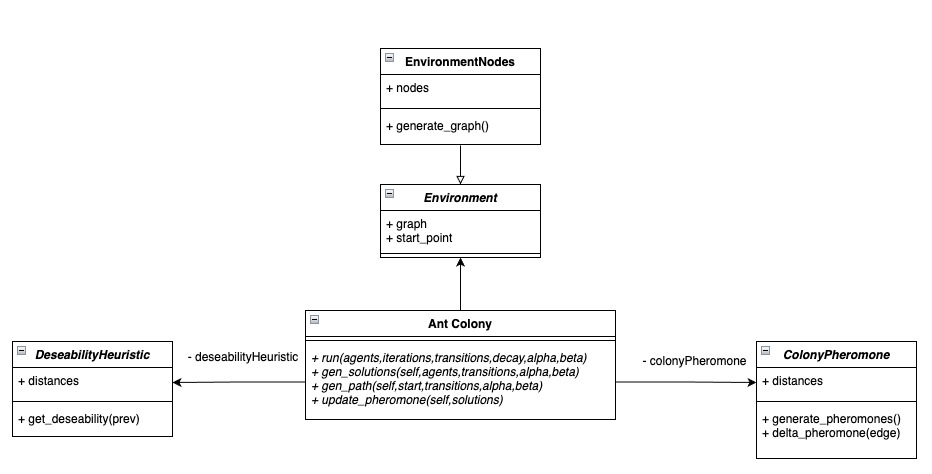

# Computación de enjambre
    
Este framework ofrece la implementación de un algoritmo de optimización por colonia de hormigas ofreciendo los componentes necesarios para construir y entrenar un modelo capaz de resolver problemas principalmente de optimización.
 
## Diagrama de clases

A continuación se presenta el diagrama de clases correspondiente

